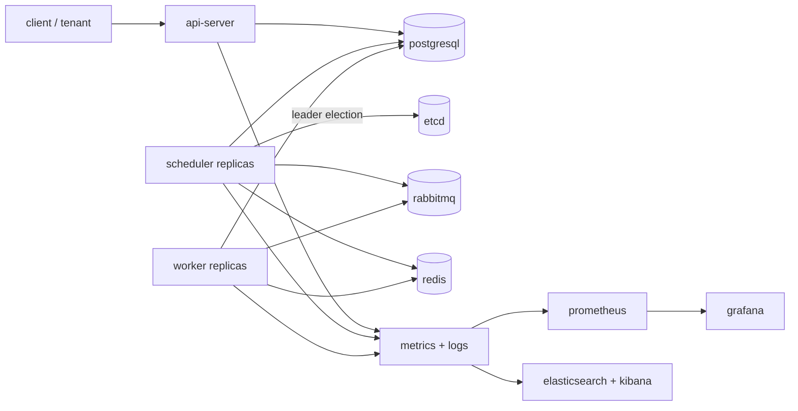
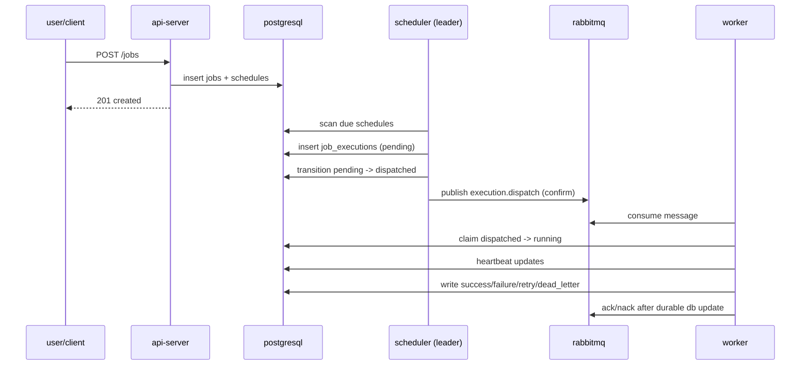
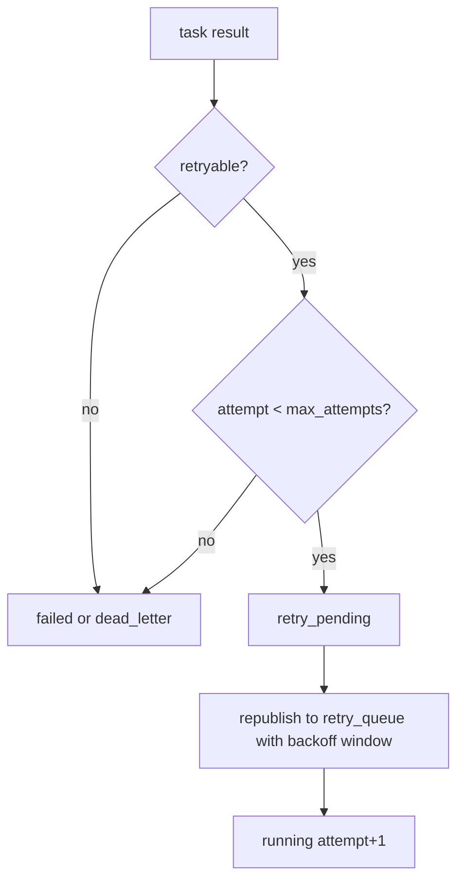
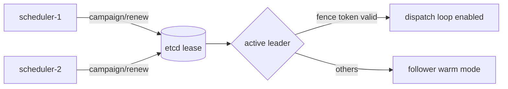

# chronos

chronos is a distributed job scheduling and execution backend written in c++20.
it is designed to be reliable under crashes, safe under duplicate delivery, and scalable by adding worker replicas.

this readme gives you:
- full-system overview
- hld (high-level design)
- high-level lld (low-level design)
- dataflow diagrams
- deployment and operations guidance

---

## 1) what chronos is solving

chronos provides a control-plane + execution-plane architecture for asynchronous jobs:

- schedule one-time and cron jobs
- dispatch jobs through a queue
- execute jobs concurrently
- retry deterministically with backoff
- move poison/unrecoverable jobs to dead letter
- recover from worker/scheduler failures
- observe health through metrics, logs, dashboards, alerts

core design principle:
**postgresql is source of truth; queue/redis are runtime aids, not truth.**

---

## 2) tech stack

- language/build: c++20, cmake
- database: postgresql
- queue: rabbitmq
- coordination/cache: redis
- leader election: etcd
- local runtime: docker compose (single root `docker-compose.yml`)
- orchestration target: kubernetes
- observability: prometheus, grafana, elastic stack

---

## 3) system hld (high-level design)

### 3.1 component map



### 3.2 core responsibilities

- **api-server**
  - accepts requests
  - validates/authenticates
  - persists job/schedule data
  - exposes query and ops endpoints

- **scheduler**
  - only leader dispatches
  - scans due schedules in batches
  - creates durable execution rows
  - publishes dispatch messages with confirms
  - runs reconciliation/recovery loops

- **worker**
  - consumes from queue
  - claims execution ownership
  - runs task in thread pool
  - heartbeats + timeout handling
  - writes terminal/retry state before ack

- **shared-core**
  - domain models
  - retry/backoff logic
  - state machine transitions
  - messaging contracts
  - coordination abstractions

---

## 4) dataflow diagrams

### 4.1 job submission to execution



### 4.2 retry and dead-letter flow



### 4.3 leader election and failover



---

## 5) high-level lld (low-level design)

## 5.1 domain entities

- `job`
  - immutable identity + task type + payload + policy refs
- `job_schedule`
  - cron/one-time timing definition and next_run_at
- `job_execution`
  - one logical run instance with lifecycle state
- `job_attempt`
  - per-attempt runtime history
- `worker_heartbeat`
  - liveness signal for running attempt
- `execution_events`
  - append-only audit trail
- `outbox_events`
  - durable dispatch intent/event relay

## 5.2 execution state machine

canonical path:
- `pending -> dispatched -> running -> succeeded|failed|retry_pending|dead_letter`
- `retry_pending -> dispatched`

transition validation is centralized in shared-core state machine logic.

## 5.3 scheduler internal flow

1. validate leadership + fence token
2. query due schedules (batch)
3. compute due/misfire decision
4. enforce dedupe (local + coordination key)
5. create durable execution row
6. persist outbox dispatch intent
7. transition to dispatched
8. publish queue message with confirm
9. rely on reconciliation for drift repair

## 5.4 worker internal flow

1. consume message from main/retry queue
2. decode + validate message version
3. claim execution in db (dispatched -> running)
4. acquire idempotency lock (coordination aid)
5. execute handler in thread pool with timeout budget
6. update db state using result mapping
7. ack/nack only after durable state update

## 5.5 api internal flow

1. parse request + request-id
2. authn/authz checks
3. tenant extraction + quota checks
4. validate payload
5. db/repository operation
6. audit log emission
7. metrics update and response

---

## 6) reliability and correctness guarantees

- at-least-once delivery tolerated
- duplicate delivery does not corrupt durable state
- scheduler failover uses lease + fencing
- retries are deterministic (policy + attempt count + error classification)
- recovery scanners handle stale/stuck runs
- redis outage does not break correctness (fail-open non-critical paths)

---

## 7) security and multi-tenant hardening

implemented baseline:
- tenant-aware quotas/counters
- namespace isolation hooks (header-based strict mode)
- audit event logging baseline
- security policy docs for secrets/tls/oidc migration

production hardening path:
- jwt/oidc validation middleware
- tls/mtls for all critical links
- secret manager integration + rotation policy

---

## 8) observability and operability

### 8.1 metrics

key metrics include:
- schedule lag
- queue depth
- dispatch attempts/success
- success/failure/retry counts
- worker utilization
- task latency
- db latency
- election churn and active leader

### 8.2 logs

structured logs include context fields:
- `job_id`
- `execution_id`
- `attempt`
- `worker_id`
- `trace_id`

### 8.3 dashboards and alerts

provided assets:
- prometheus scrape + rules
- grafana dashboard json
- filebeat -> elastic config
- alerts for backlog, failure rate, leader absence, timeout growth

### 8.4 runbooks

runbooks available for:
- dead letters
- stuck executions
- queue congestion
- failover incidents

---

## 9) deployment model

## 9.1 local/full backend (single compose file)

use root compose only:

```bash
docker compose up -d --build
```

scale workers:

```bash
docker compose up -d --scale worker=10
```

## 9.2 kubernetes baseline

`k8s/` contains:
- deployments/statefulset for core services
- hpa for workers
- pdbs
- rolling update defaults

---

## 10) chaos, slo, and scale readiness

- chaos scripts: worker kill, leader kill, rabbitmq pause, redis pause, db restart
- slo spec includes schedule latency, success ratio, recovery time, alert response targets
- scale scripts/checklists focus on:
  - db write throughput
  - queue saturation
  - scheduler scan cost

---

## 11) repository layout

- `api-server/`
- `scheduler/`
- `worker/`
- `shared-core/`
- `db-migrations/`
- `docs/`
- `ops/`
- `k8s/`
- `scripts/`
- `tests/`
- root `docker-compose.yml`

---

## 12) important current note

api-server now runs as a long-lived listener on `0.0.0.0:8080` in container mode.
for endpoints, use:
- `/health`
- `/metrics`
- job/schedule/execution routes

if `/` is used directly, a not-found response is expected unless a root handler is added.

---

## 13) architecture references

see `docs/architecture/` for phase-by-phase design and implementation notes:

- 01 system boundaries
- 02 concrete defaults
- 03 domain model
- 04 interface contracts
- 05 developer baseline
- 06..15 phase implementation docs

---

if you want, next i can generate:
- a separate `hld.md` and `lld.md`
- a png/svg architecture diagram set
- an operator quickstart runbook (`first 30 minutes in production`).
